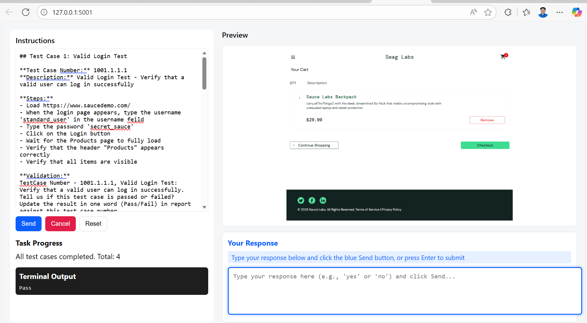
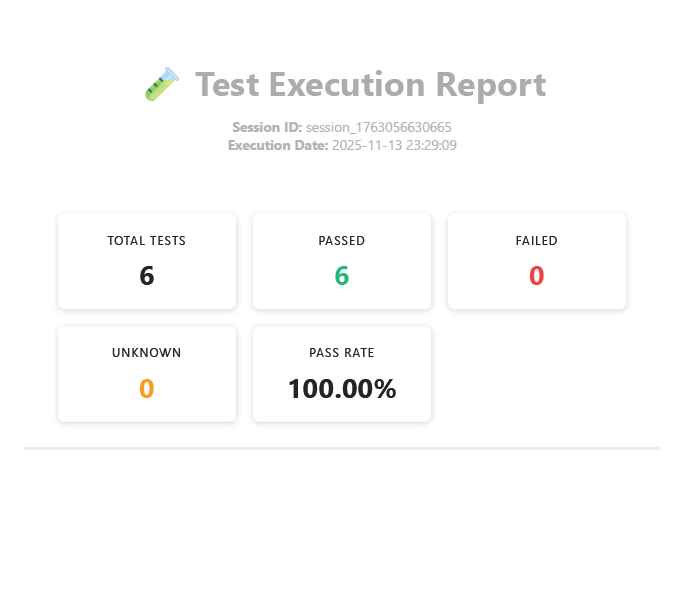

# CUA Test Automation - Code Flow Documentation


Team Members : Rajat Jaiswal (52346854) , Shivanshu Kumar  (52346821) , Aryan Singla (52346825)
## 🎯 Overview

This is an **AI-powered Computer Use Automation (CUA)** system that executes automated test cases on web applications using OpenAI's computer use API and Playwright browser automation. The system provides a web interface for submitting test instructions, monitors execution in real-time, and generates professional HTML reports.

### Key Features
- ✅ AI-driven browser automation
- ✅ Session-based test execution
- ✅ Real-time progress monitoring
- ✅ Screenshot capture per test case
- ✅ Professional HTML report generation
- ✅ Support for multiple test cases in single run

---

## 🏗️ Architecture

```
┌─────────────────────────────────────────────────────────────┐
│                      Web Interface (Flask)                  │
│                      webui/server.py                        │
└──────────────┬──────────────────────────────────────────────┘
               │
               │ HTTP Requests
               │
┌──────────────▼──────────────────────────────────────────────┐
│                   Backend Routes                            │
│  /api/send-task  |  /api/task-status  |  /api/test-report   │
└──────────────┬──────────────────────────────────────────────┘
               │
               │ Creates Background Thread
               │
┌──────────────▼──────────────────────────────────────────────┐
│              Task Runner (run_cua_task)                     │
│  • Parses test cases from instructions                      │
│  • Creates session ID                                       │
│  • Initializes browser and agent                            │
└──────────────┬──────────────────────────────────────────────┘
               │
               │ For each test case
               │
┌──────────────▼──────────────────────────────────────────────┐
│          Single Test Executor (run_single_testcase)         │
│  • Runs agent with test instructions                        │
│  • Captures screenshots                                     │
│  • Determines Pass/Fail                                     │
│  • Saves results to JSON                                    │
└──────────────┬──────────────────────────────────────────────┘
               │
               │ Uses
               │
┌──────────────▼──────────────────────────────────────────────┐
│                    Agent (agent/agent.py)                   │
│  • Manages AI model interactions                            │
│  • Handles computer actions                                 │
│  • Processes safety checks                                  │
└──────────────┬──────────────────────────────────────────────┘
               │
               │ Controls
               │
┌──────────────▼──────────────────────────────────────────────┐
│        Browser (computers/default/local_playwright.py)      │
│  • Playwright browser automation                            │
│  • Screenshot capture                                       │
│  • Page interactions (click, type, scroll)                  │
└─────────────────────────────────────────────────────────────┘
```

---

## 🔄 System Flow Diagram

```
User Input (Web UI)
       │
       │ 1. Submit Instructions
       │
       ▼
┌──────────────────┐
│  Flask Server    │
│  /api/send-task  │
└────────┬─────────┘
         │
         │ 2. Create Task & Background Thread
         │
         ▼
┌─────────────────────┐
│   run_cua_task()    │
│  • Generate Session │
│  • Parse Test Cases │
│  • Init Browser     │
└────────┬────────────┘
         │
         │ 3. For Each Test Case
         │
         ▼
┌───────────────────────────┐
│  run_single_testcase()    │
│  • Format Instructions    │
│  • Create Agent Input     │
└────────┬──────────────────┘
         │
         │ 4. Execute Test
         │
         ▼
┌─────────────────────────┐
│   Agent.run_full_turn() │
│  • Call OpenAI API      │
│  • Process Actions      │
│  • Handle Safety Checks │
└────────┬────────────────┘
         │
         │ 5. Browser Actions
         │
         ▼
┌──────────────────────────┐
│ LocalPlaywrightBrowser   │
│  • click(), type()       │
│  • screenshot()          │
│  • get_current_url()     │
└────────┬─────────────────┘
         │
         │ 6. Capture Results
         │
         ▼
┌──────────────────────────────┐
│  save_test_case_result()     │
│  • Parse Pass/Fail           │
│  • Save to JSON              │
│  • Store Screenshot          │
└────────┬─────────────────────┘
         │
         │ 7. Generate Report
         │
         ▼
┌──────────────────────────────┐
│  generate_last_session_html()│
│  • Load JSON Report          │
│  • Create HTML Report        │
│  • Include Screenshots       │
└──────────────────────────────┘
```


## 📁 File Structure and Dependencies

```
openai-cua-sample-app/
│
├── webui/
│   ├── server.py                          # Flask server (entry point)
│   ├── generate_last_session_report.py    # HTML report generator
│   ├── templates/
│   │   └── index.html                     # Web UI
│   ├── static/
│   │   ├── app.js                         # Frontend JavaScript
│   │   └── style.css                      # UI styling
│   └── test_reports/
│       ├── test_case_report.json          # Test results (JSON)
│       └── last_session_report.html       # Generated HTML report
│
├── agent/
│   └── agent.py                           # AI Agent orchestrator
│
├── computers/
│   ├── computer.py                        # Protocol definition
│   ├── default/
│   │   └── local_playwright.py            # Browser implementation
│   └── shared/
│       └── base_playwright.py             # Base Playwright class
│
├── utils.py                               # Helper functions
├── requirements.txt                       # Python dependencies
└── .env                                   # Environment variables (OPENAI_API_KEY)
```

### Dependency Graph

```
server.py
  ├── agent.py
  │   ├── utils.py (create_response, sanitize_message)
  │   └── computer.py (Protocol)
  │
  ├── local_playwright.py
  │   └── base_playwright.py
  │       └── playwright.sync_api
  │
  └── generate_last_session_report.py
      └── test_case_report.json

```

---

## 🔑 Key Components

### 1. **Agent** (`agent/agent.py`)
- **Purpose**: Bridge between AI model and computer
- **Key Methods**:
  - `run_full_turn()`: Executes one complete interaction cycle
  - `handle_item()`: Processes model outputs (actions, messages)
- **Dependencies**: OpenAI API, Computer interface

### 2. **Computer** (`computers/default/local_playwright.py`)
- **Purpose**: Browser automation via Playwright
- **Key Methods**:
  - `click()`, `type()`, `scroll()`, `keypress()`
  - `screenshot()`: Captures current page state
  - `get_current_url()`: Returns active page URL
- **Dependencies**: Playwright library

### 3. **Flask Server** (`webui/server.py`)
- **Purpose**: Web interface and API endpoints
- **Key Routes**:
  - `/api/send-task`: Start new test execution
  - `/api/task-status/<id>`: Poll task progress
  - `/api/test-report`: Retrieve JSON report
- **Dependencies**: Flask, Threading

### 4. **Utils** (`utils.py`)
- **Purpose**: Shared helper functions
- **Key Functions**:
  - `create_response()`: Calls OpenAI API
  - `show_image()`: Displays screenshots (debug)
  - `check_blocklisted_url()`: Security check

### 5. **Report Generator** (`webui/generate_last_session_report.py`)
- **Purpose**: Creates professional HTML reports
- **Key Function**: `generate_last_session_html()`
- **Output**: Standalone HTML file with embedded screenshots


## 📊 Report Generation

### JSON Report Structure

**File**: `webui/test_reports/test_case_report.json`

```json
{
  "test_suite": "Sauce Demo Automation Test Suite",
  "session_id": "session_1731234567890",
  "execution_date": "2025-11-24 23:29:09",
  "test_cases": [
    {
      "test_case_number": "1001.1.1.1",
      "test_case_name": "Login Test",
      "result": "Pass",
      "executed_at": "2025-11-24 23:29:45",
      "instructions": "TestCase Number - 1001.1.1.1, Login Test: ...",
      "terminal_output": "I'll enter the username...\nTyping password...\nDashboard is visible. Test Passed.",
      "screenshot": "iVBORw0KGgoAAAANSUhEUgAA..." 
    }
  ],
  "summary": {
    "total_tests": 1,
    "passed": 1,
    "failed": 0,
    "unknown": 0,
    "pass_rate": "100.00%"
  }
}
```

### HTML Report Features

**File**: `webui/test_reports/last_session_report.html`

Generated by running:
```bash
python webui/generate_last_session_report.py
```

## 📸 UI Screenshots

### Main Dashboard Interface




---


### HTML Report Sample



---
